<h1 style="color:rgb(47, 178, 143); font-size: 120px;">Überblick</h1>

1. Erklärung
2. Historie
3. Mathematik
4. Einflüsse
5. Bildkomposition
6. Tipps

---
<h1 style="color:rgb(47, 178, 143); font-size: 90px;">Erklärung</h1>

- Sehr häufig in Natur und Mensch
- Naheliegend, dass Mensch dies als angenehm / schön empfindet

---

<h1 style="color:rgb(47, 178, 143); font-size: 70px;">Moderne Anwendungen</h1>

- Anatomische Genauigkeit bei Menschen
- Wiederherstellung bestimmter Körperteile 
- Moderne Schönheitschirurgie & Zahnmedizin

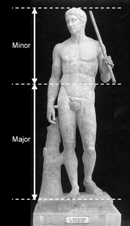
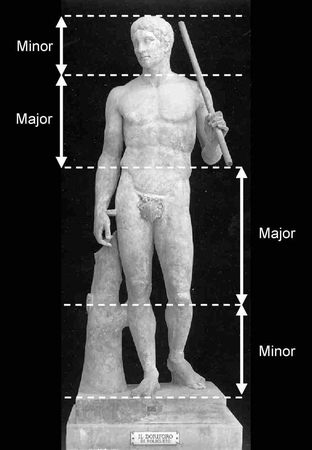

---

---

<h1 style="color:rgb(47, 178, 143); font-size: 90px;">Historie</h1>

- Seit der griechischen Antike nachgewiesen
- Renaissance: philosophische und theologische Zusammenhänge
- Ab 1900 größerer Bekanntheitsgrad
- Mark Barr 👨‍🔬: Φ bzw. φ [fi:] = 1,618 

---

<h1 style="color:rgb(47, 178, 143); font-size: 90px;">Mathematik</h1>

a = 1, b = √5
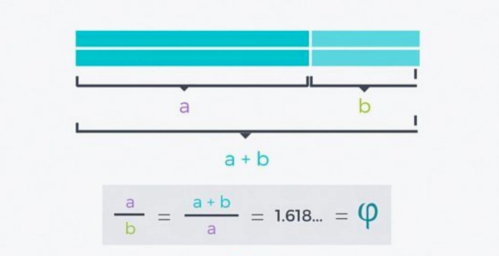

---

<h1 style="color:rgb(47, 178, 143); font-size: 70px;">Einflüsse</h1>

- Kunst oder Architektur 
- Natur
- Mathematik

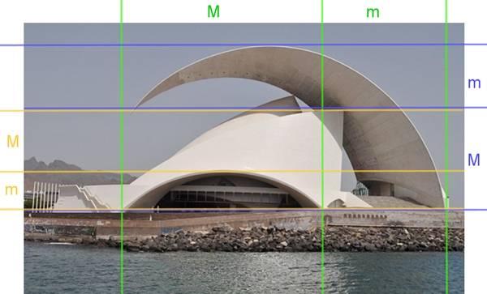

---

<h1 style="color:rgb(47, 178, 143); font-size: 90px;">Bildkomposition</h1>

- Ein Prinzip der Bildaufteilung
- Bild wirkt besonders harmonisch und ausgewogen
- In vielen Meisterwerken anzutreffen

---

<h1 style="color:rgb(47, 178, 143); font-size: 90px;">Bildkomposition</h1>

###### 4 goldene Schnittachsen schneiden sich an 4 Bildpunkten 
###### - auch Harmoniepunkte genannt

---

---

---

---

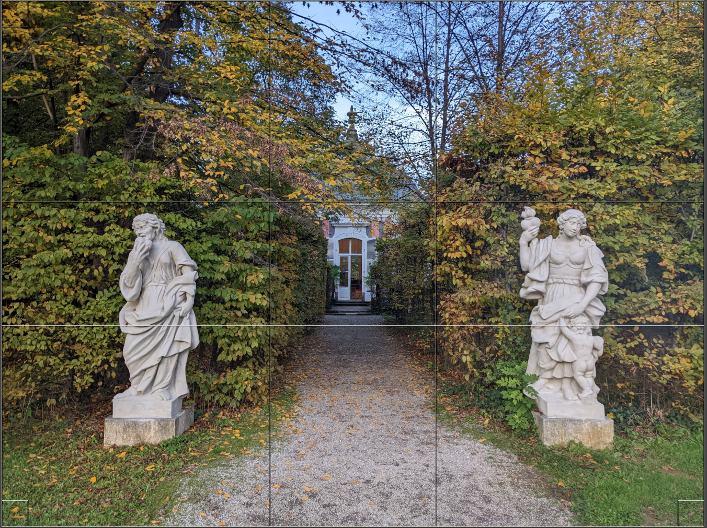

---

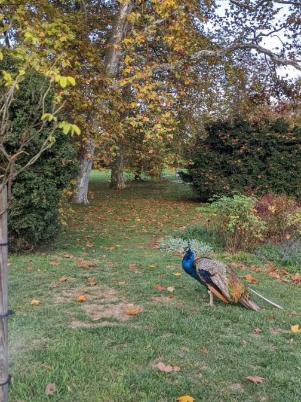

---

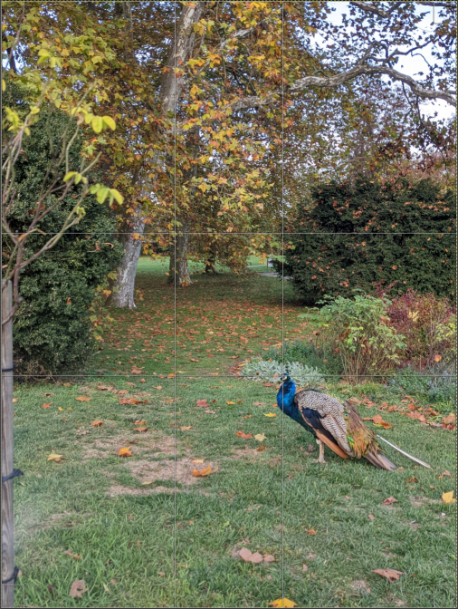

---

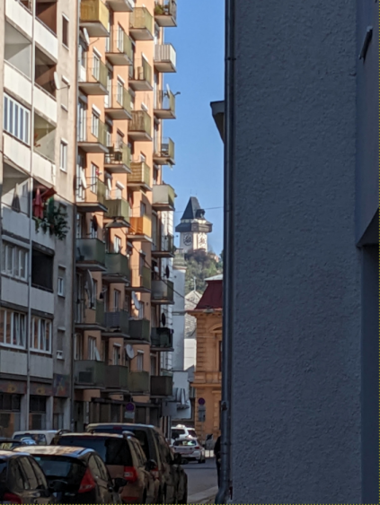

---

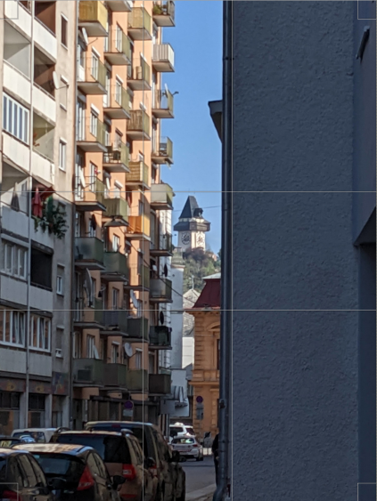

---

<h1 style="color:rgb(47, 178, 143); font-size: 90px;">Drittelregel</h1>

- je 2 horizontale und vertikale Linien
- wir erhalten 9 gleich große Teile
- Schnittpunkte / Linien sind Hauptmerkmale

---

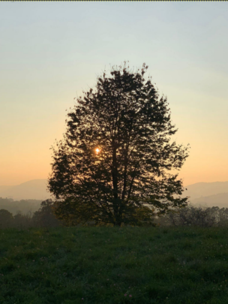

---

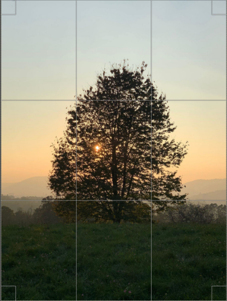

---

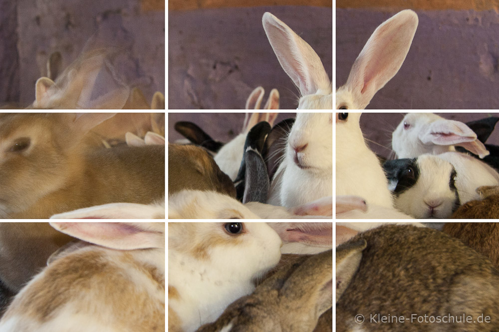

---

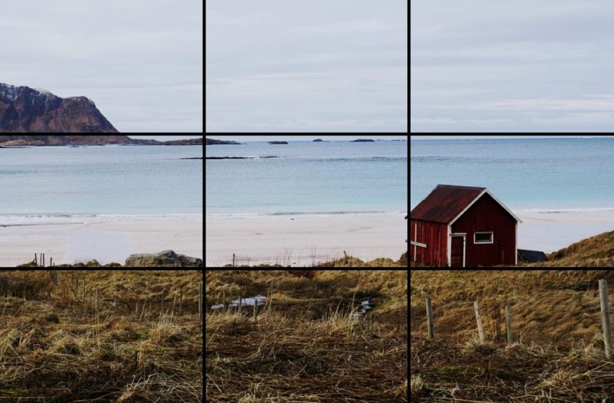

---

<h1 style="color:rgb(47, 178, 143); font-size: 90px;">Tipps</h1>

##### Raster am Handy aktivieren
=> Gerade Fotos und im goldenen Schnitt